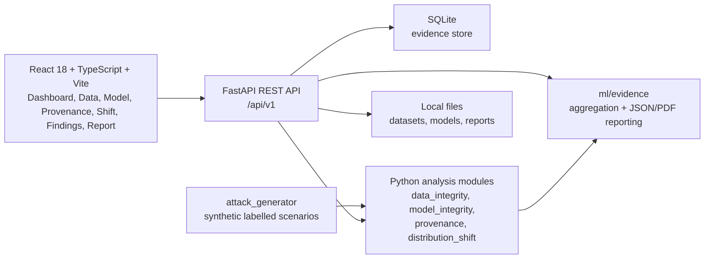

# KavachAI — Offline AI-Assurance Workbench

KavachAI is a controlled-evaluation prototype for computer-vision assurance. It
checks data integrity, model integrity, inference provenance, and distribution
shift, then combines the resulting evidence into human-readable findings and
JSON/PDF assurance reports.

The workbench addresses a practical assurance problem: reviewers need to
inspect evidence about datasets, models, and inference records before relying
on an AI system. KavachAI keeps the individual checks and their evidence
visible instead of reducing them to one opaque trust score.

The current implementation is designed for offline, reproducible evaluation
with synthetic data, seeded attack scenarios, and local storage. It is a
research prototype, not a production deployment or a claim that all attacks
can be detected. Findings and dispositions are recommendations; human
reviewers remain the final decision-makers.

## Key capabilities

| Module | What it checks | Evidence produced | Current status |
|---|---|---|---|
| **Data Integrity** | Trigger-like patches, near-duplicate groups, contributor skew, label-distribution signals, and outlier/OOD-related signals | Per-finding detection method, affected assets, measured scores, severity, confidence, and limitations | Evaluated only on the documented synthetic suites. The full demo reports trigger recall 0.20 at precision 0.889; near-duplicate recall 1.00; OOD attribution recall 0.000. |
| **Model Integrity** | Hash/manifest metadata, weight statistics, behavior agreement, trigger flip-rate, and a STRIP-inspired entropy probe | Per-check `pass`, `flag`, or honest `unavailable` status with measured result and explanatory note | Scikit-learn MLP demo models are evaluated. ONNX and `.pt`/`.pth` weight-level checks are **Not evaluated yet**. |
| **Provenance** | A SHA-256 hash-linked ledger for inference records and post-hoc tampering | Record hashes, previous hashes, chain status, and the exact broken record when tampering is detected | The documented five-record chain verifies, and controlled middle/tip tampering is detected. |
| **Distribution Shift** | Reference-versus-current feature-distribution deviation | Verdict (`NORMAL`, `EXPECTED_DRIFT`, or `SUSPICIOUS_SHIFT`), anomaly fraction, metrics, and an interpretation disclaimer | Evaluated on the documented synthetic reference, brightness, and OOD scenarios only. |
| **Evidence Aggregation / Reporting** | Cross-module findings and disposition policy | `ACCEPT`, `REVIEW`, or `QUARANTINE` recommendation plus JSON and ReportLab PDF reports | Implemented; dispositions are recommendations and do not replace human review. |

## Architecture

KavachAI is a React 18/TypeScript single-page application built with Vite and
served by a FastAPI application. The backend persists evidence in SQLite,
coordinates the Python analysis modules, and serves JSON APIs, the built SPA,
and generated PDF reports. The analysis libraries under `ml/` do not depend on
FastAPI.



See [ARCHITECTURE.md](ARCHITECTURE.md) for request flows, the SQLite schema,
security design, and implementation rationale.

## Repository structure

```text
backend/
  app/
    main.py             FastAPI application and SPA serving
    db.py               SQLite schema and connection handling
    service.py          persistence and orchestration helpers
    assurance.py        disposition synthesis
    routers/            datasets, scans, models, provenance, shift, reports, demo
frontend/
  src/
    pages/              Dashboard, Data, Model, Provenance, Shift, Findings, Report
    components/         tables, evidence drawer, charts, chain visualizer
    api/                typed API client and response types
  dist/                 built frontend served by FastAPI
ml/
  common/               hashing, features, model I/O, utilities
  data_integrity/       ingestion and integrity scans
  model_integrity/      registry and model checks
  provenance/           hash-linked chain
  distribution_shift/   reference and scoring logic
  evidence/             findings, aggregation, JSON/PDF report generation
attack_generator/       synthetic datasets and labelled attack manifests
scripts/                seed_all.py, train_demo_models.py, run_demo.sh
tests/                  pytest unit and API tests
docs/                   design and implementation documents
datasets/               packaged sample data and runtime dataset locations
models/                 reference/candidate demo models and probe data
reports/                report output location
requirements.txt        pinned backend dependencies
frontend/package.json   frontend dependencies and build scripts
API.md                  endpoint reference
```

Runtime databases, generated datasets, uploaded files, caches, and generated
reports are local artifacts and are excluded by `.gitignore` where applicable.

## Quickstart

The documented setup targets Python 3.12 and Node.js 24. macOS and Linux
commands are shown below; Windows is not a tested target in the repository
documentation.

### Backend

```bash
python3.12 -m venv .venv
source .venv/bin/activate
pip install -r requirements.txt

# Generate the clean and poisoned demo datasets and register the demo models.
python scripts/seed_all.py

# Start the API and serve the built frontend on port 8000.
python -m uvicorn backend.app.main:app --host 0.0.0.0 --port 8000
```

SQLite tables are created automatically when the application starts; there is
no separate migration command.

### Frontend

In a second terminal, from the repository root:

```bash
cd frontend
npm install
npm run build
```

The backend serves `frontend/dist` at `http://localhost:8000`, including the
SPA's client-side navigation routes. A Vite development server is also
available with `npm run dev`; its `/api` proxy targets the backend at
`http://127.0.0.1:8000`.

Check the backend:

```bash
curl http://localhost:8000/api/v1/health
```

For the container alternative, see [INSTALLATION.md](INSTALLATION.md) and
`docker/Dockerfile`.

## API

The API base path is `/api/v1`. The complete request and response reference is
in [API.md](API.md). Implemented endpoints are:

| Area | Endpoints |
|---|---|
| Health | `GET /health` |
| Datasets | `POST /datasets/upload`, `GET /datasets`, `GET /datasets/{dataset_id}`, `GET /datasets/{dataset_id}/samples`, `GET /datasets/{dataset_id}/image/{sample_id}` |
| Synthetic attacks | `POST /attacks/generate` |
| Scans | `POST /scans`, `GET /scans/{scan_id}`, `GET /scans/{scan_id}/findings` |
| Models | `POST /models/upload`, `GET /models`, `POST /models/{model_id}/checks` |
| Inference | `POST /inference/predict` |
| Provenance | `POST /provenance/anchor`, `GET /provenance/chain`, `POST /provenance/verify`, `POST /provenance/tamper-demo` |
| Distribution shift | `POST /shift/assess` |
| Findings | `GET /findings` |
| Reports | `POST /reports/generate`, `GET /reports/{report_id}.json`, `GET /reports/{report_id}.pdf` |
| Evaluation | `POST /evaluation/run` |
| Guided demo | `POST /demo/run` |

## Demo workflow

The UI follows the assurance workflow:

**Data → Model → Provenance → Shift → Findings → Report**

The one-click demo endpoint runs the documented 15-step scenario:

```bash
curl -X POST http://localhost:8000/api/v1/demo/run \
  -H 'Content-Type: application/json' \
  -d '{}'
```

The response contains the step results, experiment ID, report ID, and PDF URL.
The demo uses the seeded synthetic scenario (seed 42, 600 samples) when no
seed is supplied. See [DEMO_SCRIPT.md](DEMO_SCRIPT.md) for the narrated
walkthrough and [DEMO.md](DEMO.md) for the demo notes.

## Evaluation and measured results

The following values are reported in [EVALUATION.md](EVALUATION.md). They are
measurements of the stated synthetic, controlled setups, not general
performance claims.

| Metric | Measured result | Evaluation context | Interpretation |
|---|---:|---|---|
| Full-demo steps | 15/15 OK | `POST /api/v1/demo/run`, seed 42, 600 samples | The documented guided workflow completed successfully in that setup. |
| Trigger-patch precision / recall | 0.889 / 0.200 | Full-demo scan versus labelled ground truth | The heuristic is precise in this setup but misses most injected trigger patches. |
| Near-duplicate precision / recall | 0.443 / 1.000 | Full-demo scan versus 12 injected groups | All injected groups were detected in the documented setup, with false alarms. |
| OOD attribution recall | 0.000 | Full-demo scan versus labelled OOD samples | The outlier method did not attribute OOD samples in this setup. |
| Overall scan precision / recall / F1 | 0.375 / 0.633 / 0.471 | `scan_4e26c0ca9d67`, 600-sample evaluation | Aggregate result for the documented attack mix; it is not a deployment benchmark. |
| Trigger flip-rate | Candidate 0.97 vs reference 0.38; difference +0.59 | Shipped scikit-learn MLP demo models | The trigger probe was flagged. |
| Behavior agreement | 0.885 → flag | Standalone model-integrity test setup | The result belongs to that smaller test-model/probe setup, not the full-demo comparison. |
| Weight-stat deviation | 0.0202 → pass | Standalone model-integrity test setup | The measured maximum relative deviation passed that check. |
| STRIP-inspired entropy | Candidate 1.3530 vs reference 1.3383 bits → pass | Standalone model-integrity test setup | The measured entropy check passed in that setup. |
| Provenance chain | 5 records verify; middle and tip tampering detected | Controlled provenance tests/demo | The hash-linked ledger detected the documented tampering cases. |
| Clean distribution shift | `NORMAL`, anomaly fraction 0.025 | Held-out clean synthetic input | The input remained close to the reference in this setup. |
| Brightness/OOD shift | `SUSPICIOUS_SHIFT`, anomaly fraction 1.000 | Synthetic brightness ×1.35 and OOD noise | The inputs deviated from the reference; shift alone does not establish malice. |

Results not listed here are **Not evaluated yet** unless explicitly documented
elsewhere in the repository.

## Security and assurance design

- Findings retain detection methods, measured evidence, confidence, severity,
  limitations, and a proposed disposition.
- Provenance records are linked with SHA-256 hashes. Verification reports the
  exact broken record when a link is invalid.
- `ACCEPT`, `REVIEW`, and `QUARANTINE` are review recommendations, not
  automatic authorization or blocking decisions.
- The application is designed for offline runtime after dependencies are
  installed. It makes no runtime telemetry, model-download, or external lookup
  calls according to the project documentation.
- Upload validation includes size, filename/path, extension, and magic-byte
  checks. Foreign or tampered pickles are refused, and `.pt`/`.pth` files are
  not unpickled.
- The provenance chain detects post-hoc tampering; it does not prevent a
  privileged party with database write access from rewriting history.

## Limitations

KavachAI is explicitly bounded by the limitations in
[KNOWN_LIMITATIONS.md](KNOWN_LIMITATIONS.md), including:

1. Trigger recall is low and depends on the operating point.
2. OOD samples may be detected without being attributed; documented OOD recall
   is 0.000 in the full-demo setup.
3. Trigger-like behavior probes do not reconstruct the trigger pattern.
4. End-to-end model checks cover scikit-learn MLPs; ONNX and PyTorch weight-level
   checks are **Not evaluated yet**.
5. Measured data is synthetic; real-world imagery is **Not evaluated yet**.
6. Shift thresholds are illustrative and were demonstrated on the same
   synthetic corruptions; they are not operational calibration.
7. Near-duplicate grouping can split large injected groups.
8. Adversarial adaptation, target-device performance, and human-factors
   effectiveness are **Not evaluated yet**.
9. Running the demo resets the provenance ledger for reproducibility.
10. Absence of findings does not prove absence of tampering or compromise.

See [FUTURE_ROADMAP.md](FUTURE_ROADMAP.md) for explicitly unevaluated future
work. No production-readiness claim is made.

## Reproducibility

The generator and demo use deterministic seeds; the shipped full demo uses
seed 42 and 600 samples. Attack manifests store the generated ground truth for
the controlled evaluation. The standalone data suite uses seed 7 and 300
samples as documented in [EVALUATION.md](EVALUATION.md).

```bash
source .venv/bin/activate
python scripts/seed_all.py
curl -X POST http://localhost:8000/api/v1/demo/run \
  -H 'Content-Type: application/json' \
  -d '{"seed": 42}'
python -m pytest tests -q
```

The evaluation setup, attack types, interpretation guidance, and explicitly
unevaluated areas are documented in [EVALUATION.md](EVALUATION.md).

## Testing

The repository contains pytest unit and API tests under `tests/`. In the
current verified checkout, the suite reports **64 passed**:

```bash
python -m pytest tests -q
```

The frontend build performs TypeScript checking followed by the Vite
production build:

```bash
cd frontend
npm run build
```

The historical evaluation document reports an earlier 63-test run; use the
current command and checkout as the source of truth for the present count.

## Technology stack

| Area | Technology |
|---|---|
| Frontend | React 18, TypeScript, React Router |
| Backend | FastAPI, Uvicorn, Pydantic |
| Database | SQLite |
| ML / analysis | Python modules, NumPy, SciPy, scikit-learn, Pillow, ONNX metadata support |
| Reporting | JSON evidence bundles and ReportLab PDF |
| Testing | pytest, FastAPI/httpx test client |
| Build tooling | Vite, npm, TypeScript |

## Project status

**Prototype / controlled evaluation.** The repository demonstrates an offline
assurance workflow under documented synthetic conditions. It is **not a
production deployment** and the repository does not establish production
readiness, broad attack coverage, or operational calibration.

## Responsible use and honesty statement

Results are specific to the documented evaluation setup, seeds, synthetic
datasets, model formats, and thresholds. Synthetic or controlled results must
not be treated as guarantees for real-world imagery or other model families.
Failure to detect an issue does not prove that no issue exists. Reports and
dispositions are evidence for review; human judgment remains essential.

## Team / Hackathon context

The repository identifies this work as a Smart India Hackathon 2026 prototype
for problem statement **SIH26228** and names **Team SRIJAN** in its project
documentation. No additional team, institution, award, or deployment claim is
made here.

## License

License not specified: no `LICENSE` file is present in the repository.

## Documentation

- [Installation and troubleshooting](INSTALLATION.md)
- [Architecture and security model](ARCHITECTURE.md)
- [API reference](API.md)
- [Evaluation and reproduction](EVALUATION.md)
- [Demo script](DEMO_SCRIPT.md)
- [Known limitations](KNOWN_LIMITATIONS.md)
- [Future roadmap](FUTURE_ROADMAP.md)
- [References](REFERENCES.md)
